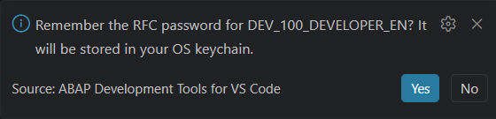
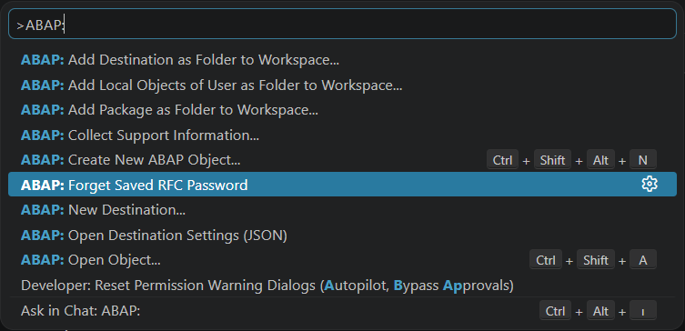

# abap-vscode-rfc-remember-password

Optional "Remember me" credential persistence for classic RFC logon in SAP's
official **ABAP Development Tools for VS Code** extension, version **1.0.1 and
newer**.

This is a small, public, MIT patcher. It does NOT perform the logon itself: the
official extension already does that natively since 1.0.1. This project only
adds the one piece native logon deliberately leaves out: optionally remembering
the password so you are not prompted on every logon.

## What you'll see

After a successful logon where you just typed your password, you are asked once
whether to remember it:



Choose **Yes** and the next logon to that destination connects without a prompt.
That single question is the only thing this patch adds to the user interface.

## The gap this fills

Since version 1.0.1 the official extension can log on to classic on-premise
systems with an RFC username and password natively. By design it does NOT
remember the password: it re-prompts every time, with no keychain and no way to
save or forget a credential. That is a deliberate security choice by SAP.

If you would rather not retype your password on every logon, this patcher adds
opt-in persistence around that native flow.

## What it does

- After a successful RFC logon where you just typed the password, it asks once:
  **"Remember the RFC password for <destination>?"** with **Yes / No**.
- On **Yes**, the password is stored in your operating system keychain through
  VS Code SecretStorage (Windows Credential Manager, macOS Keychain, or
  libsecret on Linux). It is never written to a file and never stored in plain
  text.
- On the next logon to that destination, the saved password is used
  automatically and you are not prompted.
- **Self-healing:** if a saved password later stops working (for example you
  changed it on the SAP side), it is deleted automatically and you are simply
  prompted again next time.
- A command **"ABAP: Forget Saved RFC Password"** lists your saved destinations
  and deletes the one you pick.

## What it does NOT do

- It does not modify the native password prompt. The native logon flow runs
  untouched; the only addition is the one Yes/No question after success.
- It does not touch the extension's Java jar, decompile anything, or require a
  JDK. It is pure text editing of two files in the installed extension.
- It does not send your password anywhere. Storage is local, in the OS keychain.
- It does not change browser-based logon for HTTP/cloud systems. This is for
  classic RFC username/password logon only.

## What gets changed

The patch touches exactly two files inside your installed extension:

| File | Change |
|---|---|
| `dist/_bundle/extension.js` | Four small insertions: capture SecretStorage and register the Forget command at activation; auto-use a saved password; stash a typed password pending success; save on success or self-heal on failure. |
| `package.json` | Registers the "Forget Saved RFC Password" command so it appears in the Command Palette. |

The exact text we search for and the exact text we insert live as plain data in
[patch/payloads.json](patch/payloads.json), so every change is auditable. The
deeper explanation is in [docs/HOW-IT-WORKS.md](docs/HOW-IT-WORKS.md).

## Requirements

- The official "ABAP Development Tools for VS Code" extension, version 1.0.1 or
  newer, already installed.
- Windows: PowerShell 5.1 or newer (built in). No other dependency.
- macOS / Linux: `perl` (preinstalled on macOS and every mainstream Linux).
  No other dependency.

## Install

Clone or download this repository, then run the patcher for your platform.

Windows (PowerShell):

```powershell
./patch.ps1
```

macOS / Linux:

```bash
chmod +x patch.sh
./patch.sh
```

By default the patcher finds the newest installed `sapse.adt-vscode-*`
extension. You can point it at a specific install:

```powershell
./patch.ps1 -ExtensionDir "C:\Users\<you>\.vscode\extensions\sapse.adt-vscode-<version>-win32-x64"
```

```bash
./patch.sh "$HOME/.vscode/extensions/sapse.adt-vscode-<version>"
```

After patching, run **Developer: Reload Window** in VS Code (or restart it) so
the patched extension is loaded.

## Use

1. Log on to an RFC destination as usual. The native password prompt appears.
2. Type your password. When the logon succeeds, you are asked whether to
   remember it. Choose **Yes** to save it to the OS keychain.
3. Next time, the logon uses the saved password automatically.

### Forgetting a saved password

The command appears in the Command Palette as **ABAP: Forget Saved RFC
Password**:



1. Open the Command Palette (`Ctrl+Shift+P` / `Cmd+Shift+P`).
2. Run **`ABAP: Forget Saved RFC Password`**.
3. Pick the destination whose password you want to remove.

After that, the next logon to that destination prompts you again. If you have no
saved passwords, the command just tells you so.

## Undo and full removal

There are no backups and no revert step by design. To undo the patch, reinstall
or update the official extension, which gives you a fresh, unmodified copy. The
patcher also refuses to run twice: if it detects it has already patched an
install, it does nothing.

Everything the patch changes lives inside the extension's own folder
(`~/.vscode/extensions/sapse.adt-vscode-<version>`, on Windows under
`%USERPROFILE%\.vscode\extensions\...`), so reinstalling, updating, or deleting
that folder removes every trace of the patch. Saved passwords are separate: they
live in the OS keychain, so use the Forget command (or your OS credential
manager) to remove them.

## After an extension update

Updating the extension installs a new versioned folder with the original,
unpatched files, so just run the patcher again on the new version. If SAP
changed the relevant internals, the text anchors may no longer match, in which
case the patcher stops safely and changes nothing (it never half-patches). If
you rely on persistence, consider disabling auto-update for the extension so you
patch on your own schedule.

## Troubleshooting

- **I am never asked to remember the password.** A password may already be saved
  for that destination (auto-use then skips the prompt), or you previously chose
  No. Run **ABAP: Forget Saved RFC Password** to reset, then log on again.
- **It still prompts every time even after I said Yes.** Your keychain may be
  locked or unavailable, so VS Code cannot store the secret. On Linux this needs
  a working, unlocked secret service (libsecret with a keyring). Confirm other
  VS Code secrets persist on your machine.
- **The patcher says "Already patched".** That is expected and safe: it will not
  patch the same copy twice. To re-apply, reinstall or update the extension
  first.
- **The patcher says it stopped without changing anything.** An anchor did not
  match, usually because the installed extension version differs from what this
  patch targets. Check this repository for an update.
- **Does this work for cloud / BTP systems?** No. It targets classic RFC
  username/password logon only; browser-based logon is unaffected.

## Safety

- The patcher asserts that each piece of code it edits appears exactly once
  before it changes anything. If the installed version does not match, it stops
  and writes nothing.
- Our additions are wrapped so that an unexpected error in our code cannot break
  the native logon.
- Because SAP rebuilds the extension on every release, a future version may
  change the internals so the patch no longer applies cleanly. In that case the
  patcher simply stops safely; re-check this repository for an update.

## How it works

See [docs/HOW-IT-WORKS.md](docs/HOW-IT-WORKS.md) for the technical detail and
[patch/payloads.json](patch/payloads.json) for the exact, auditable edits.

## Security and responsibility

SAP deliberately chose not to persist RFC passwords. This patcher re-enables
persistence as an opt-in convenience and shifts that choice (and its
responsibility) to you. Read [DISCLAIMER.md](DISCLAIMER.md) before using it.

## Transparency

This repository contains zero SAP code or binaries. It ships only the patch
scripts, the literal find/replace payloads (short anchors plus the code we
insert), and documentation. The edits are applied locally to your own installed
copy of the extension.

## Companion project

This is the successor to
[abap-vscode-rfc-logon](https://github.com/sakirsek/abap-vscode-rfc-logon),
which added RFC username/password logon before the official extension supported
it. That capability is now native (1.0.1), so the old project is retired and
kept public as a historical record. This project fills only the remaining gap:
remembering the password.

## License

MIT. See [LICENSE](LICENSE). The MIT license covers only the contents of this
repository, not any SAP software.
